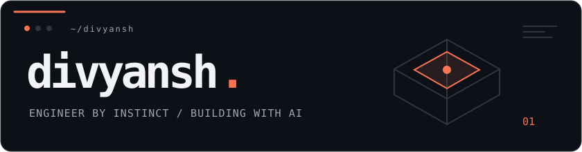
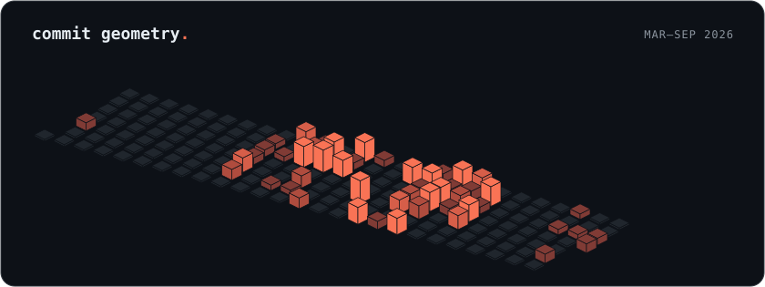

<picture>
  <source media="(prefers-color-scheme: dark)" srcset="assets/nameplate-dark.svg">
  <source media="(prefers-color-scheme: light)" srcset="assets/nameplate-light.svg">
  
</picture>

 

**ECE @ RVCE** &nbsp;·&nbsp; AI obsessed &nbsp;·&nbsp; Linux enthusiast &nbsp;·&nbsp; Codeforces Specialist

I like hard problems, useful software, and making the computer do the boring part.

 

&nbsp;
&nbsp;
&nbsp;

 

### built & shipped

[**LifeRebuild**](https://liferebuild.app) &nbsp;·&nbsp; [**CoreXY plotter**](https://github.com/divyanshchandhok/mcp-2d-plotter) &nbsp;·&nbsp; [**sukoon**](https://github.com/divyanshchandhok/sukoon) &nbsp;·&nbsp; [**FP64 on FPGA**](https://github.com/divyanshchandhok/addc-ft-pbl)

 

<picture>
  <source media="(prefers-color-scheme: dark)" srcset="assets/isocalendar-dark.svg">
  <source media="(prefers-color-scheme: light)" srcset="assets/isocalendar-light.svg">
  
</picture>

 

AI in the loop, curiosity at the wheel.

  

[LifeRebuild](https://liferebuild.app) &nbsp;·&nbsp; [LinkedIn](https://www.linkedin.com/in/divyanshchandhok/)

